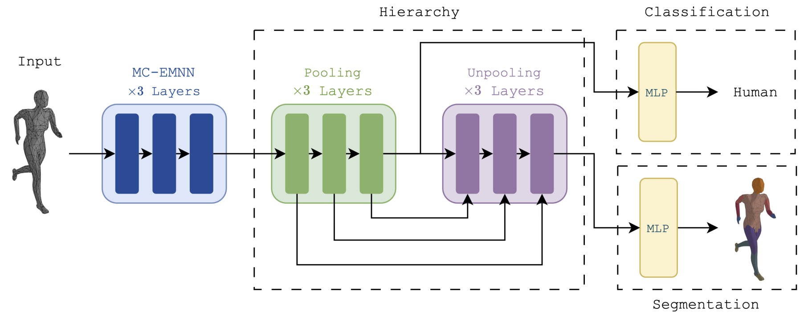

# E(3)-Equivariant Mesh Neural Networks

Published at AISTATS 2024

Proceedings: https://proceedings.mlr.press/v238/anh-trang24a/anh-trang24a.pdf

Preprint: https://arxiv.org/pdf/2402.04821.pdf



## Running experiments

Run this command

```
# Train
sh scripts/{data}/train.sh
# Eval
sh scripts/{data}/eval.sh
```

## Environment setups

Follow these commands below:
```
conda create --name emnn python=3.7
conda activate emnn

conda install pytorch=1.11 cudatoolkit=11.3 -c pytorch

conda install pyg=2.0.3 -c pyg
pip install wandb pytorch-ignite openmesh opt_einsum trimesh
```

## Please cite our paper as follows!

```bibtex
@InProceedings{pmlr-v238-anh-trang24a,
  title = 	 { E(3)-Equivariant Mesh Neural Networks },
  author =       {Anh Trang, Thuan and Ngo, Nhat Khang and Levy, Daniel T. and Ngoc Vo, Thieu and Ravanbakhsh, Siamak and Son Hy, Truong},
  booktitle = 	 {Proceedings of The 27th International Conference on Artificial Intelligence and Statistics},
  pages = 	 {748--756},
  year = 	 {2024},
  editor = 	 {Dasgupta, Sanjoy and Mandt, Stephan and Li, Yingzhen},
  volume = 	 {238},
  series = 	 {Proceedings of Machine Learning Research},
  month = 	 {02--04 May},
  publisher =    {PMLR},
  pdf = 	 {https://proceedings.mlr.press/v238/anh-trang24a/anh-trang24a.pdf},
  url = 	 {https://proceedings.mlr.press/v238/anh-trang24a.html},
  abstract = 	 { Triangular meshes are widely used to represent three-dimensional objects. As a result, many recent works have addressed the need for geometric deep learning on 3D meshes. However, we observe that the complexities in many of these architectures do not translate to practical performance, and simple deep models for geometric graphs are competitive in practice. Motivated by this observation, we minimally extend the update equations of E(n)-Equivariant Graph Neural Networks (EGNNs) (Satorras et al., 2021) to incorporate mesh face information and further improve it to account for long-range interactions through a hierarchy. The resulting architecture, Equivariant Mesh Neural Network (EMNN), outperforms other, more complicated equivariant methods on mesh tasks, with a fast run-time and no expensive preprocessing. Our implementation is available at \url{https://github.com/HySonLab/EquiMesh}. }
}
```
